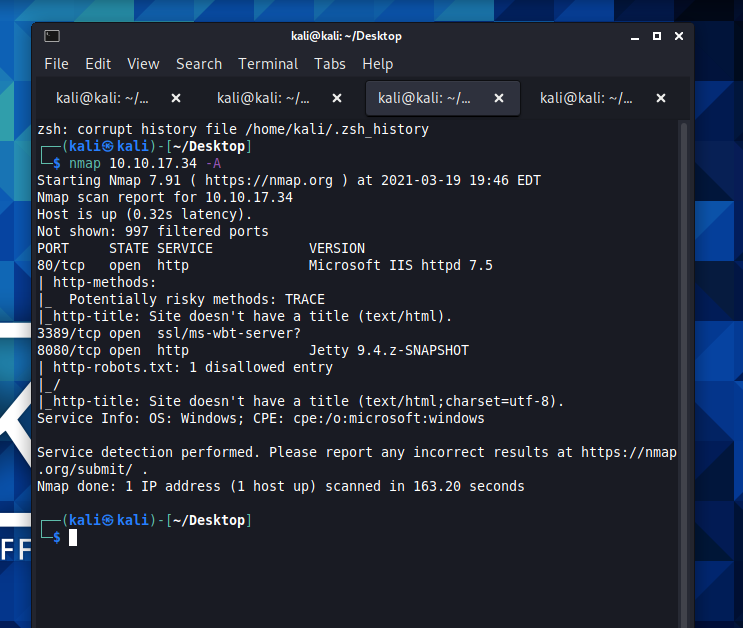
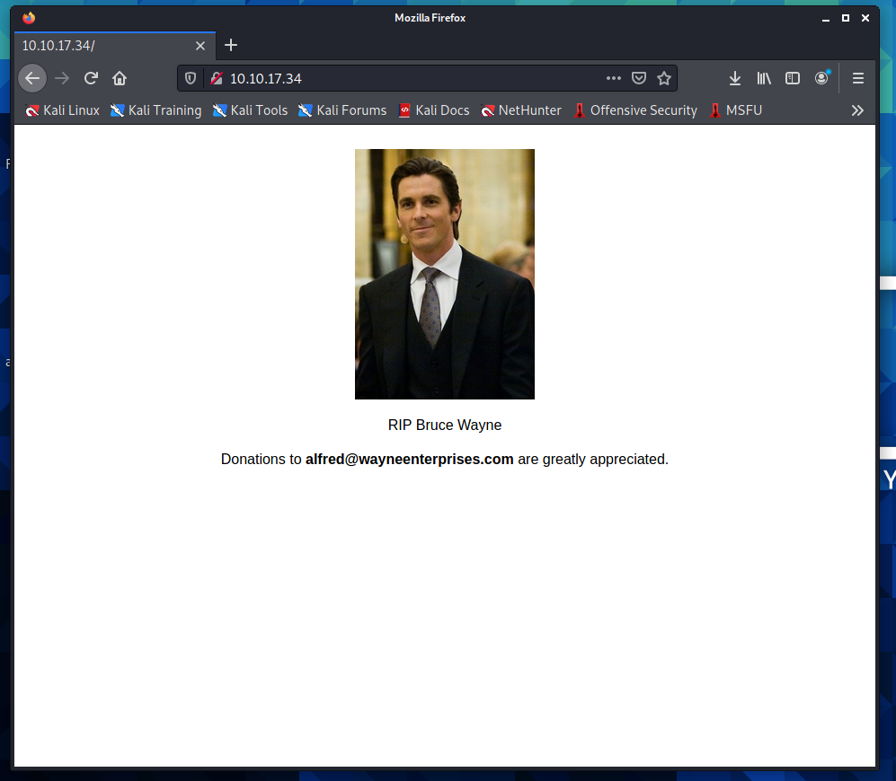
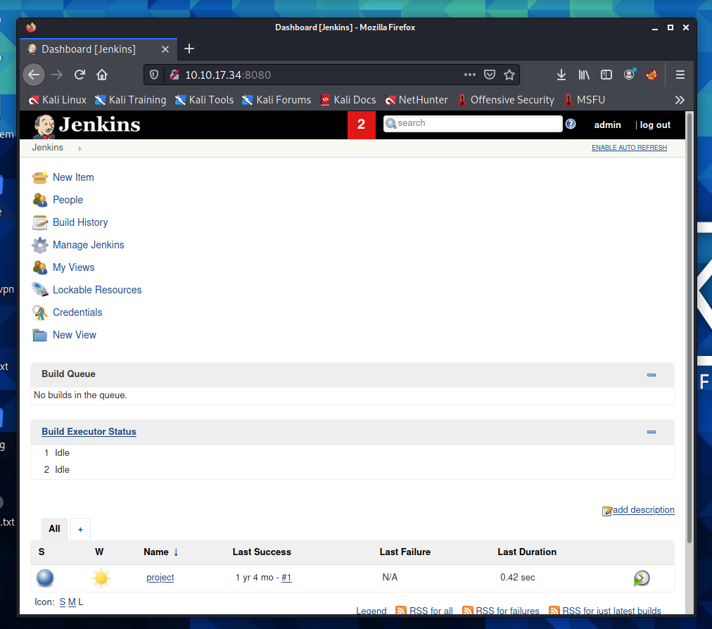
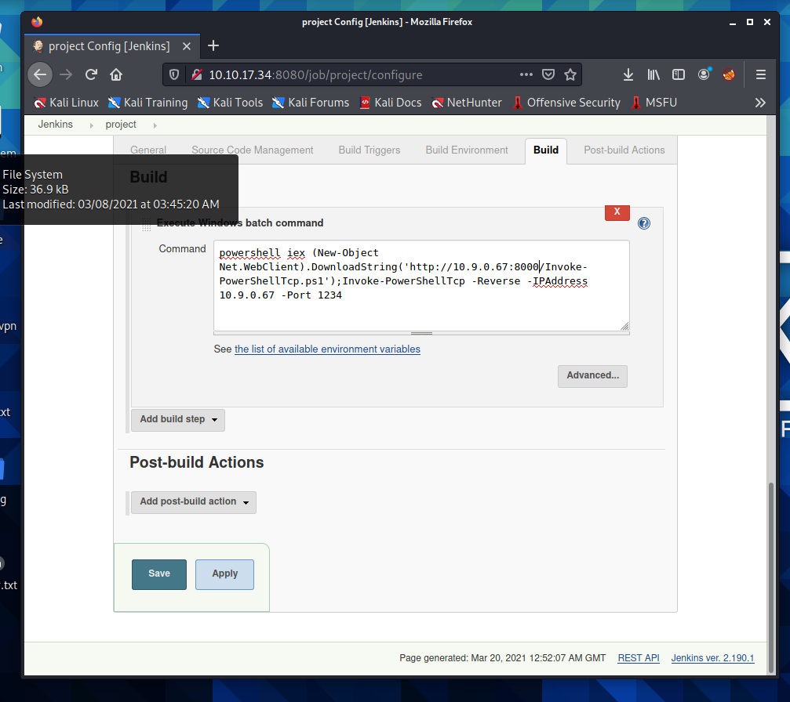
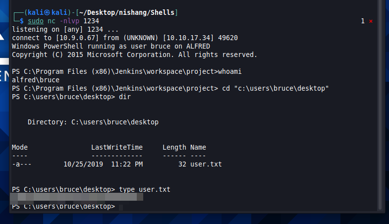
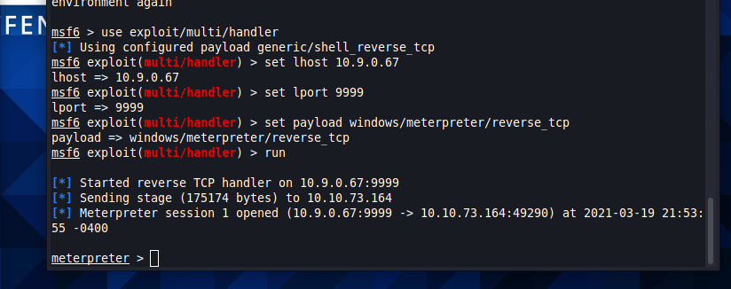

# Alfred
Exploit Jenkins to gain an initial shell, then escalate your privileges by exploiting Windows authentication tokens. In this room, we'll learn how to exploit a common misconfiguration on a widely used automation server(Jenkins - This tool is used to create continuous integration/continuous development pipelines that allow developers to automatically deploy their code once they made change to it). After which, we'll use an interesting privilege escalation method to get full system access. 

## Initial Access
The first thing we need to do after deploying the machine is run our namp scan. We run a quicker scan on the most popeular 1000 ports and determine that there are 3 ports open.

We can then fire up firefox and head over to port 80 to see what's happening there. 

There is nothing all that exciting on this page though so we now head over to 8080 where we see a login for Jenkins. A quick google tells me that the default login for Jenkins is admin. Before I fire up a tool to help me find the password, I try a few of the common default passwrods. Username admin with a password of admin gains us access. 

Since this is a Windows application, we'll be using Nishang to gain initial access. The repository contains a useful set of scripts for initial access, enumeration and privilege escalation. In this case, we'll be using the reverse shell scripts. Poking around the admin area of portal we find the config options where we are able to enter commands to be executed on build. We set up a python server to host our malicious script and a netcat listener. Running the build with the script seen in the image below call through to our listener and provide us with a shell.

We are in! From here we can move around the machine and find our user flag.

Following this we now want to upgrade our shell to a meterpreter shell. To do this we use msfvenom to create a payload, and use our netcat shell to repeat the steps we originally went through to gain access. We set a listener up on metasploit using the multi/handler exploit and fire everything off. We have upgraded our shell!

##### From here there were significant issues with the box breaking. It was constantly closing off and kicking me off. In the end I got fed up and moved on. I will return when time permits to finish out this machine.