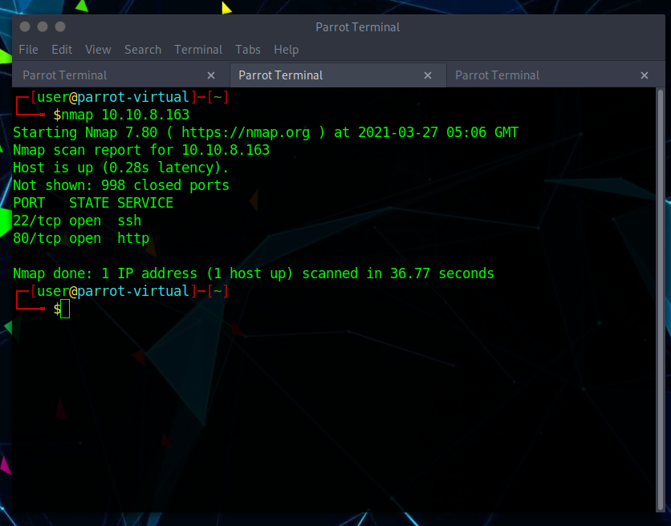
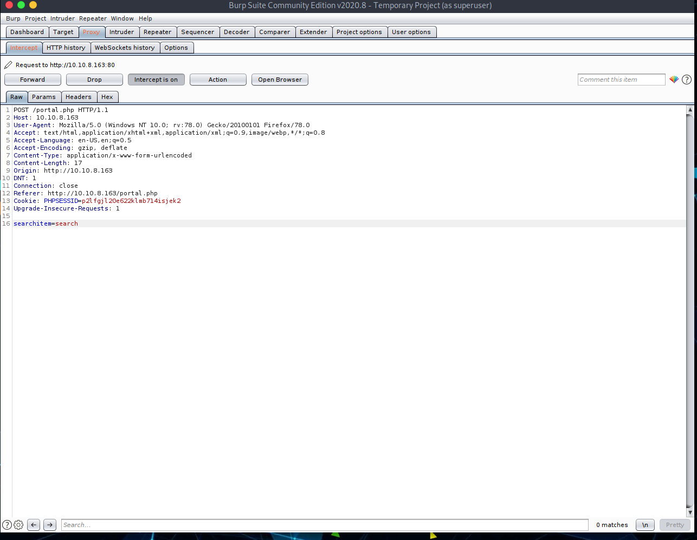

# Gamezone
Learn to hack into this machine. Understand how to use SQLMap, crack some passwords, reveal services using a reverse SSH tunnel and escalate your privileges to root! This room will cover SQLi (exploiting this vulnerability manually and via SQLMap), cracking a users hashed password, using SSH tunnels to reveal a hidden service and using a metasploit payload to gain root privileges.
 
## Deploy the vulnerable machine
The first thing we need to do is deploy our machine and run a quick nmap scan checking for open ports. We see that port 80 is open so we can fire up our browser and head over to check that out. The first question regarding the identity of the sniper wielding character on the web page is easily answered and we can move on to our next section.
 

 
## Obtain access via SQLi
In this task you will understand more about SQL (structured query language) and how you can potentially manipulate queries to communicate with the database. In our GameZone machine, when you attempt to login, it will take your inputted values from your username and password, then insert them directly into the query above. If the query finds data, you'll be allowed to login otherwise it will display an error message.
 
We are able to gain entry by performing an SQL injection attack on the login form. Nearly all modern frameworks have built-in functions that will automatically sanatise any user input before running it, however this forum seems to be built using poor user input handling practices.
 

 
We answer the question regarding where we have been redirected following our successful login attempt, and we can move onto the next task.
 
## Using SQLMap
There are many different types of SQL injection (boolean/time based, etc..) and SQLMap automates the whole process trying different techniques. We're going to use SQLMap to dump the entire database for GameZone.
 
We need to intercept a request made to the web pages search feature which we can use Burp Suite to accomplish. Making sure that your proxy is set up and intercept is on, fire off a search. We can see the request that is being made and save it to a txt file for use with SQLMap.
 

 
Running SQLMap using the txt file we just created, we have automated a lot of our work. We already know the website is vulnerable to SQL injections and this tool will help exploit that far quicker than we can ourselves. We gett
 

 
We get some good stuff from SQLMap, including a hashed password, username, and DB table names. We answer the questions from this section and we can move on.
 
## Cracking the password with JohnTheRipper
John the Ripper (JTR) is a fast, free and open-source password cracker. This is also pre-installed on all Kali Linux machines. We will use this program to crack the hash we obtained earlier. JohnTheRipper is 15 years old and other programs such as HashCat are one of several other cracking programs out there. This program works by taking a wordlist, hashing it with the specified algorithm and then comparing it to your hashed password. If both hashed passwords are the same, it means it has found it. You cannot reverse a hash, so it needs to be done by comparing hashes.
 
We can see our hashed password has been cracked!
 

 
From here we can attempt to SSH into the machine using our newly found username and password.
 

 
We are in! We are free to move around thie machine, searching for our user flag. We find it and grab the flag before moving onto the next section.
 

 
## Exposing services with reverse SSH tunnels
Reverse SSH port forwarding specifies that the given port on the remote server host is to be forwarded to the given host and port on the local side.
 
-L is a local tunnel (YOU <-- CLIENT). If a site was blocked, you can forward the traffic to a server you own and view it. For example, if imgur was blocked at work, you can do ssh -L 9000:imgur.com:80 user@example.com. Going to localhost:9000 on your machine, will load imgur traffic using your other server.
 
-R is a remote tunnel (YOU --> CLIENT). You forward your traffic to the other server for others to view. Similar to the example above, but in reverse.
 
We are going to utilise a tool called ss to search for any sockets running on a host. We can see that a service is running on port 10000, but being blocked by a firewall rule from outside. We will use an SSH Tunnel to expose the port to us locally. Once we have done this we can view the web service via local host. We find some details regarding the CMS in use and grab the version before heading on to the next section.
 

 
## Privilege Escalation with Metasploit
This part of the room gives us little in the way of hints and we are expected to use the knowledge we have gained so far to get root. We know the CMS version being used so we can open Metasploit and check for vulnerabilities that affect this version of webmin.
 
After a little trial and error I have found what I believe is the correct exploit. I have set the options required and am ready to fire off the exploit. It may be important to note that you should remember to set your payload. MEtasploit will not prompt you too but the exploit will not work without first doing so.
 

 
Our exploit is successful and we are in!
 

 
Now it's just a matter of poking around until we find our root flag. We find it as expected, and grab it to finish  out the room.
 

 
