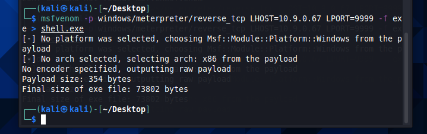
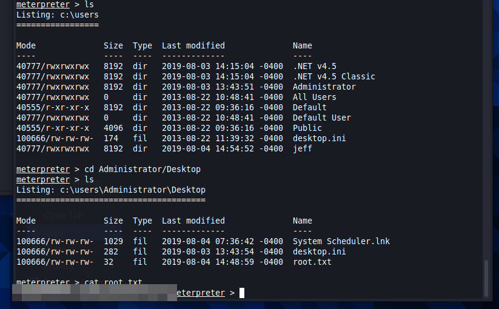

# HackPark
Bruteforce a websites login with Hydra, identify and use a public exploit then escalate your privileges on this Windows machine! This room will cover brute-forcing an accounts credentials, handling public exploits, using the Metasploit framework and privilege escalation on Windows.

## Deploy the vulnerable Windows Machine
First things first we need to launch the machine and run an nmap scan to see what we are dealing with. I've been experimenting with a new nmap methodolgy where I now run the quickest scan that will only check for open ports, alongside the more detailed scan. This gives me access to at least some information while I wait for the more detailed scan. Sometimes the more detailed scan isn't even required, as shown in this machine.

The first question is asking us what the name of the clown displayed on the home page is. We can fire up firefox and head over to port 80 to see our clown.

## Using Hydra to brute-force a login
Brute-forcing can be trying every combination of a password. Dictionary-attack's are also a type of brute-forcing, where we iterating through a wordlist to obtain the password.Hydra is a parallelized, fast and flexible login cracker. 

We first need to find a login page and find out what type of requests the form is making to the webserver. Generally it will be either GET and POST requests. This can be done using Burp Suite but we are going to use the inbuilt browser tools to get through it quickly.

The first thing we do is right click the login form and inspect element, which shows us that the form is making a POST request. We can jow begin crafting our Hydra command and begin our attempt at cracking the password. To make things faster I wanted to find out what username we could use, and sicne their is nothing on the page to tell us whether our guesses were correct I decided to take a stab and use admin. We need to input a valid path for Hydra before launching it, as well as the invalid login command. Switching over to the network tab of the browser developer tools and attempting an invalid login allows us to view the request body. Additionally we can also see the the invalid message is 'Login failed'.

We can put all of this together to form quite a lengthy Hydra command. We are using the rockyou wordlist which contains over 14 million passwords. That is probably overkill for this exercise but I went big before really considering a smaller wordlist. In the end Hydra was able to check 641 passwords a minute, and find our password in under 2 1/2 minutes. 

## Compromise the machine

Now that we have our password we can access the admin page. A little poking around tells us we are dealing with BlogEngine 3.3.6.0. A search on google tells us that there is indeed an exploit that we can use to gain access to this machine. We download the exploit from exploit-db.com and make the required modifications to get it set up. Exploit-Database is a CVE (common vulnerability and exposures) archive of public exploits and corresponding vulnerable software, developed for the use of penetration testers and vulnerability researches. It is owned by Offensive Security (who are responsible for OSCP and Kali)

Reading the exploit we learn that renaming the exploit file to PostView.ascx and uploading it to the webserver is all the setup we need. We set up a netcat listener for when the exploit is triggered. Then exploit alos gives us the web server path we need to visit to trigger the exploit - http://10.10.10.10/?theme=../../App_Data/files. We visit the specified location and we are in.

## Windows Privilege Escalation
In this task we will learn about the basics of Windows Privilege Escalation. First we will pivot from netcat to a meterpreter session and use this to enumerate the machine to identify potential vulnerabilities. We will then use this gathered information to exploit the system and become the Administrator.

If we hope to utilise metasploit and upgrade to a meterpreter shell we will need to create a reverse shell payload. To do this we will ustilise msfvenom which makes the process quick and simple.

Following the creation of this payload we need to create a simple python server so that we can pull it into our hacked machine. 

Now we need to set up a listener in metasploit, using the multi handler exploit. We set our options to what they need to be and let it run, waiting for the connection to take place. After this we can run an Invoke-WebRequest command from our netcat shell and run the payload. This will call our metasploit listener and give us our upgraded meterpreter shell. 

From here we can move around the system answering the questions asked of us. While enumerating the machine we are tasked with finding the abnormal service that is running. In our case this is WindowsScheduler. 

Further enumeration allows us a peek at the logs which show that the Message.exe binary is run roughly every 30 seconds. This made me think of cron jobs on a linux system and how they can be exploited.

I realise we can use the same shell.exe playload we created earlier to elevate our privileges and gain root. We create a backup file of Message.exe and replace it with shell.exe. We can than background this session, and run our listener again. Now it's just a matter of waiting for the scheduler, which we know will run this every 30 seconds, to run out payload. We are in!

From here we can move around the system collecting our flags.

## Privilege Escalation Without Metasploit
In this task we will escalate our privileges without the use of meterpreter/metasploit! Firstly, we will pivot from our netcat session that we have established, to a more stable reverse shell. Once we have established this we will use winPEAS to enumerate the system for potential vulnerabilities, before using this information to escalate to Administrator.

Throughout the course of this hack, we had already satisfied many of the requirements attached to this task. I still have my netcat shell running so I pop back over to that. I can use the same Invoke-WebRequest command to pull the winPEASx64.exe file into the Windows/Temp directory, which is generally world writeable. From here I can launch the program and see all of the information it finds about the machine. The image includes only a small portion of what it shows, it really does go through a lot. 

The final question is the provide the original install date on the machine. I'm running short on time and after a couple minutes of looking through the winPEAS output I can't see it. I run the systeminfo command and get our final answer that way.

We are done! We have completed this machine and answered all of the questions asked of us.

