# Skynet
A vulnerable Terminator themed Linux machine. This machine and room are setup to be similar to a black box penetration test, relative to previous machines on the Offensive Pentesting learning path. Very little information is given as you progress through the room and you're expected to use the knowledged you've gained in previous rooms to assist in cracking this machine.

## Deploy and compromise the vulnerable machine
The very first thin we always do is run a quick nmap scan on the box to see what ports are opened. We are scanning with the -A tag which will show us versions, OS and run scripts. We can see from the results that there are 4 open ports. The immediately interesting ports are 80 which is a web server, and 139 which is smb.

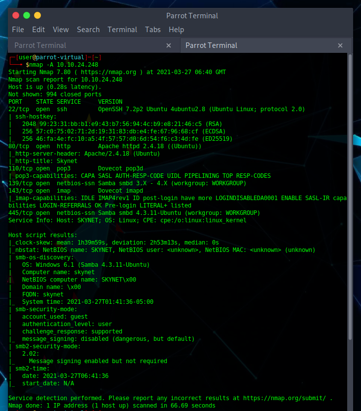

We find nothing exciting on the web server, it's just a google type clone that is static and doesn't actually do anything. The next step for us is to run gobuster against it, hoping to locate some interesting directories. We see a couple of interesting directories but the one that really stands out is /squirrelmail. We come to a login screen and are stuck. I search google for default credentials but come up empty. We don't even know a valid username so I decide not to use a brute force tool like Hydra and instead take a look at the SMB port.

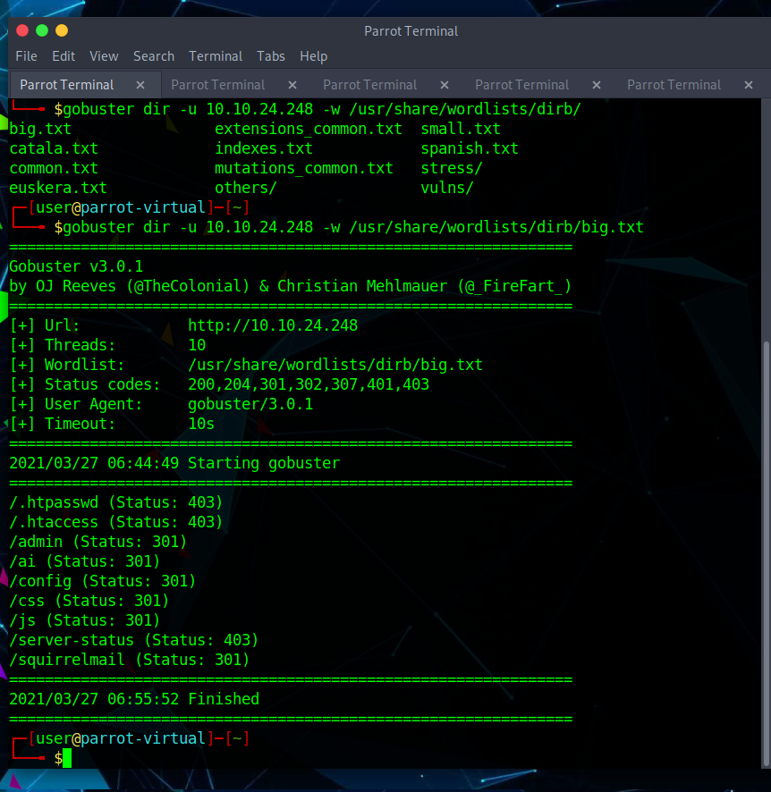

We can see SMB shares that are of interest, anonymous and milesdyson. I find that I'm unable to access milesdyson without a password but can get into anonymous just fine. When investigating the share I find a directory with the file log1.txt. This txt file contains a range of strings that look suspiciously like passwords. Maybe we have our email and password for squirrelmail. The attention.txt file advised of a mandatory password change due to a system error.

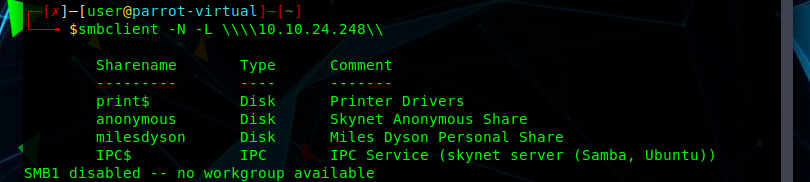
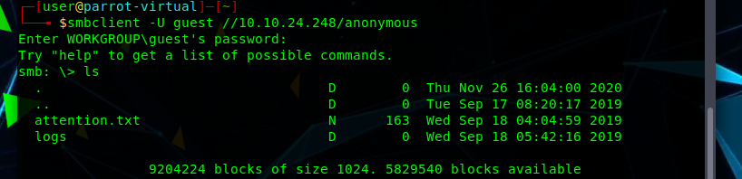
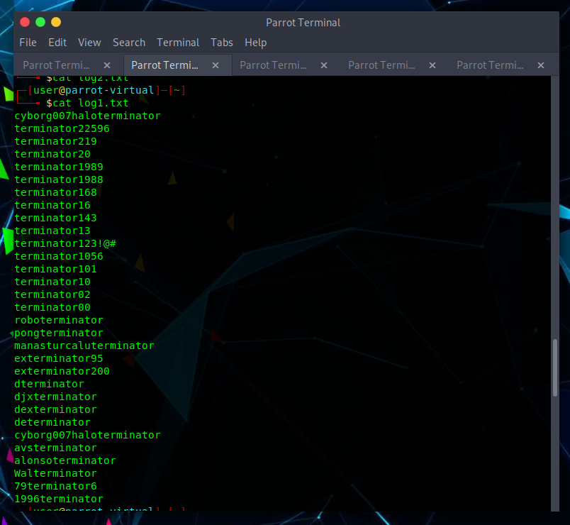

We head back over to our browser and try to login using the details we found while enumerating smb. Since we have an smb share named milesdyson I can pretty safely assume that may be a valid login. I am just about to fire up Hydra to do this for me when I decide to try the first few myself.... The first one on the list works! 

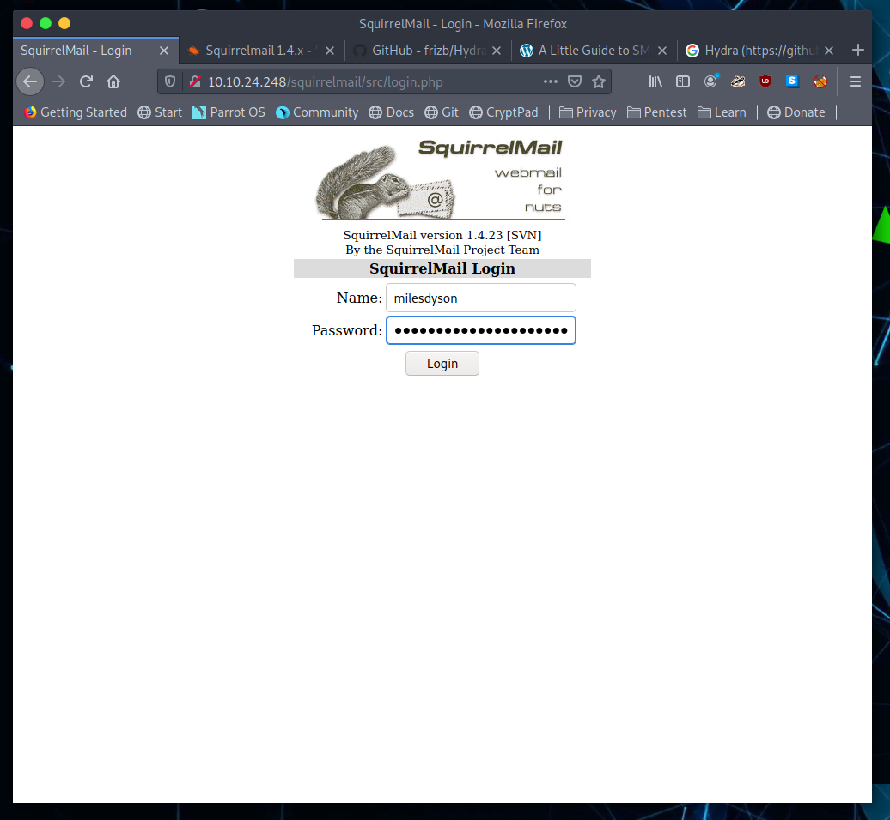

I have gained access to Miles email account and can see 3 emails. The 2 emails without a subject are filled with nonsense, although one is filled with nonsense in binary. The email that we are here for is the Samba Password Reset email. It seems like pretty awful security but we have a password now so we can back over to our terminal to see if it grants us access to the milesdyson share.

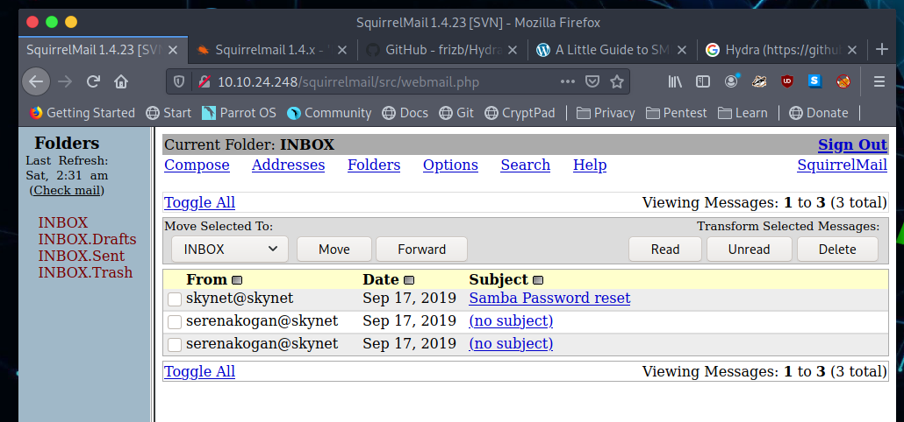
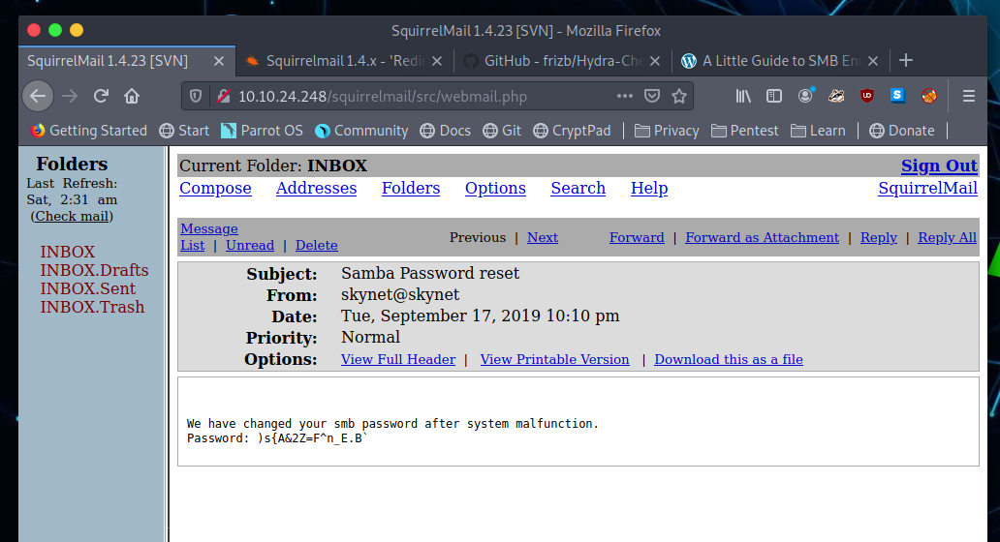

The password works and we gain access to the share. The share contains a directory called notes which is filled with PDFs containing AI and Machine Learning notes... Interesting but not what we are after. I consider my life choices as I contemplate reading through them while looking for another clue, when I see a file amongst the many called important.txt. I get the file to my own system and cat out the contents. Item 1 mentions a CMs and what looks like a directory?

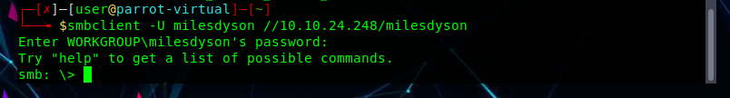
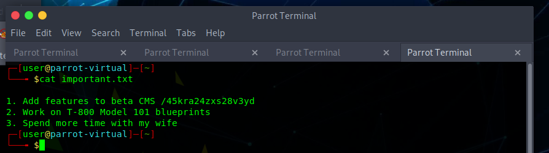

It is a secret directory thats wasn't picked up in our initial gobuster scan. There isn't much of interest here so we run another gobuster scan to see is we can find something and get a hit on /administrator. It seems I forgot to take / save several screenshots so you will have to use your imagination, but, it was the login page for a CMS called Cuppa. Our original password and username don't work but CMS are pretty notorious for vulnerabilities. I fire up exploit.db and find something that should help us.

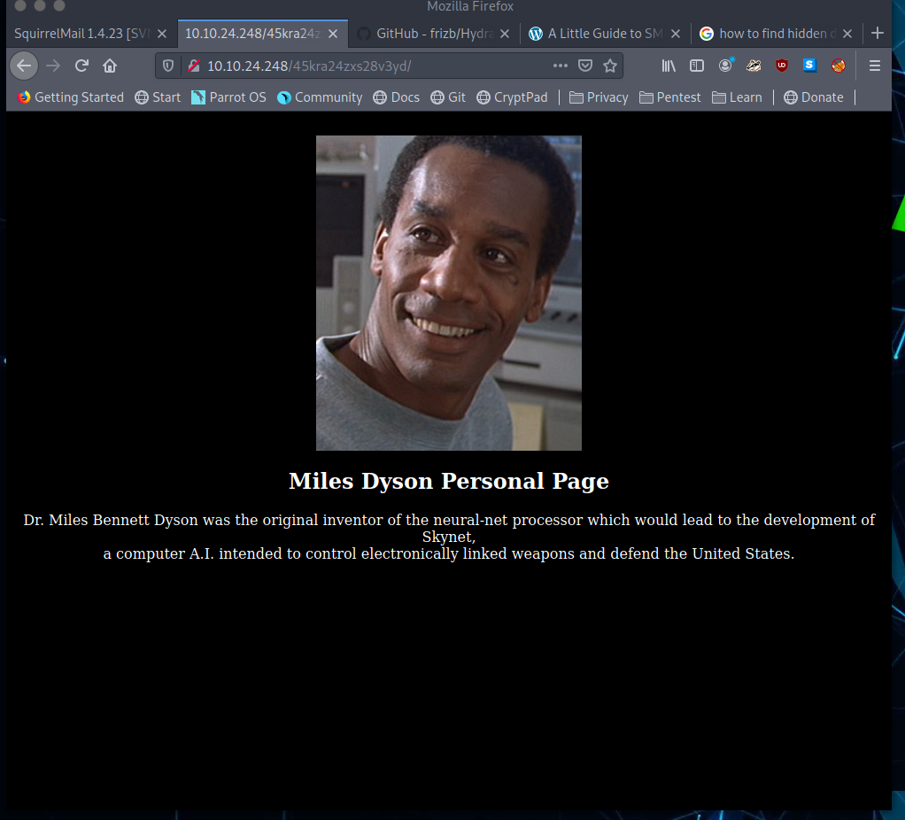
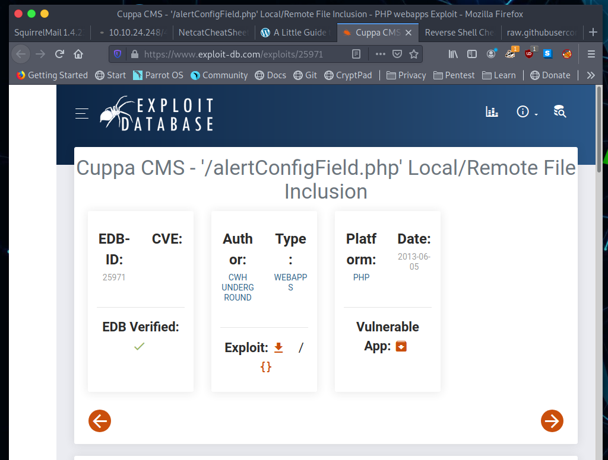

We don't even need to login to make this exploit work. I grab a php reverse shell from the pentest monkey GitHub page and make the changes required to the script. I use python to setup a simple server from where we can serve the script, and a netcat listener. We trigger the exploit by navigating to the specific location as described in the exploit. It triggers and when I check our netcat terminal we have access. From here I can have a poke around and collect the user flag.

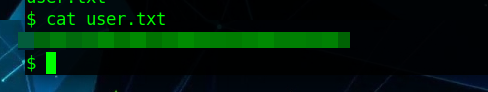

When collecting the user flag I notice the backups directory. when I cat out the contents of backup.sh I can see that it's a simple bash script that tars and backups. A bit og googling tells me this is probably running as a cron job so I check. Sure enough it is, and even better it's running as root!

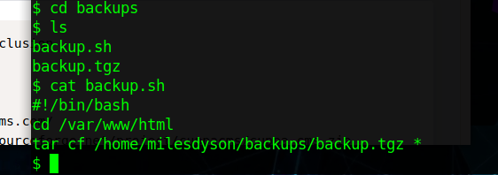
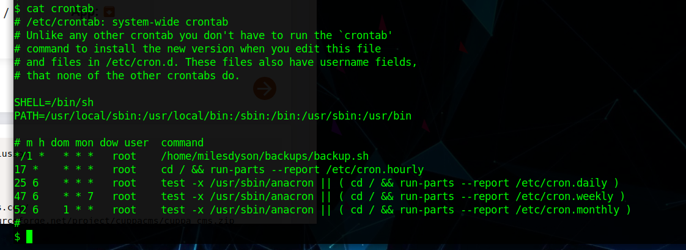

I must admit, I got a little stuck on this section and ended up looking at the writeup. I initially felt bad for doing it but I realised that you can't know what you don't know and I ended up leaving with a lot of extra things to add to my 'to learn' list. Upon completing the box I looked through what other people had done and most people seemed to have a different set of commands they used to exploit the cron job.

 Essentially what we are doing here is setting some commands that will make a call out to our own IP and the port specified. As this is a cron job running every minute, we should just have to set a netcat listener and wait for the connection.

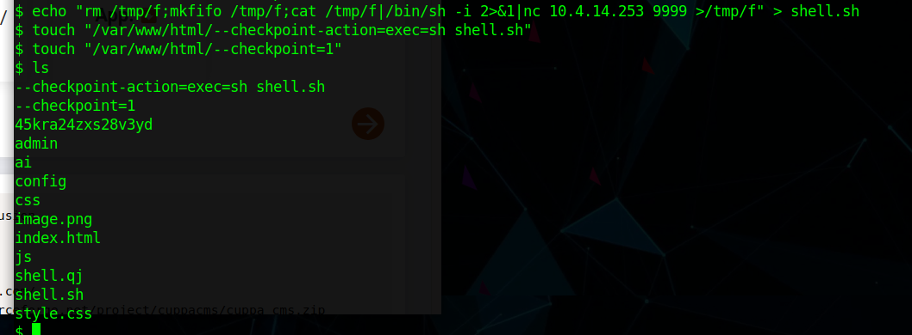
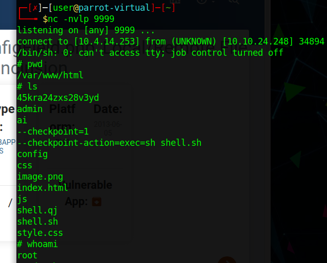

We have a connection and now we just need to poke around and collect our root flag. We do this and we are done! Room complete, even if we did rely on some help at the very end. 

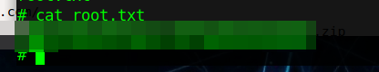
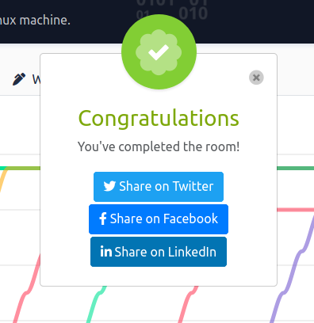

