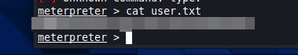

# Steel Mountain
Hack into a Mr. Robot themed Windows machine. Use metasploit for initial access, utilise powershell for Windows privilege escalation enumeration and learn a new technique to get Administrator access. In this room you will enumerate a Windows machine, gain initial access with Metasploit, use Powershell to further enumerate the machine and escalate your privileges to Administrator.

## Introduction
The first question of this room is cryptic and so far impossile to answer. Who is the employee of the month? I figure I can run my normal scans and loop back to this once I find the answer.

## Initial Access
We run our usual nmap scan and see the results below. We can see that there are 2 web servers running on both port 80 and 8080. We answer the first question which is for the port number of the 'other' server. The word other leads me to believe there is something we should see on port 80. I fire up the browser and head to the web server to see an image of our employee of the month. 

We can now have a look at the other web server running on port 8080. This is running a file server. A quick poke around and I can see that it is specifically running Rejetto HTTP File Server. A google search tells me that that this this version of Rejetto is vulnerable to a certain attack.  

I boot up Metasploit and do a quick search for Rejetto. The exploit exists inside of the Metaspoloit framework and is ready to go. We can look at the exploit options to see what we need to setup to get going. I will need to input the RHOST, RPORT, and also the LHOST. You may not need to update the LHOST, I do because of the way I hve my VM setup.

After we setup our exploit we hit run and pop a shell. A quick poke around and we find our friend Bill's account and can move through to his desktop. Once there we find our user flag and are able to submit successfully and move on.

## Privilege Escalation
We are in the system but we still need to escalate our privileges if we want to find the root flag. To do this we are going to upload an exploit we have pulled from GitHub that will allow us to check the machine for any abnormalities. 

We start a powershell an run the script by running the Invoke-AllChecks command. We can search the output from this script for a service that we may be able to utilise as part of our exploitation. We are specifically looking for the CanRestart option which we find with AdvancedSystemCareService9. CanRestart allows us to restart the service, additionally the application directory is writeable which means we can replace this program with whatever we like.

We know that we can replace a program running on the machine, and force it to restart, now we just need a payload. For this we will turn msfvenom with will take some parameters from us and create a payload for our machine. We can that take this payload and use the upload command to get it onto our machine. 

NOTE: I left midway through and had to go though the process again on a different machine, hence the different exploit file name you may notice later.

Now that we have uploaded our exploit we will need to set up a listener. We will use the multi/handler that is built into Metasploit for this. We just need to set our LPORT, and once again, potentially you LHOST, and we are good to go. We background the listener for later use and move back to our session.

Now! I'm not going to lie, this next part got me a few times. You have a really short amount of time between launching the attack and the session dying. IT was really frustrating and it took 2 rounds just to realise what was happening. I eventually got through the system though and was able to cat out the root flag. Success! 

## Access and Escalation Without Metasploit

#### Coming Soon 
This was completed and I have finished the room, but I think I may have deleted the directory I stored the images in. I am going to continue on with the learning path and loop back around when I have time.

