# Blue
Deploy & hack into a Windows machine, leveraging common misconfigurations issues. Practice exploitation through using nmap and Metasploit to own a Windows box. Attempt this room without the Metasploit exploit after your first attempt.

## Recon
In the Recon section we need to deploy the machine, VPN in from our kali box, and run an nmap scan. My usual favourite scan was taking a little long on this machine so I dropped it back to scan just the most popular 1000 ports. One of the tasks asks us to report the number of open ports with a port number under 1000, which in this case is 3. The second task is to identify what this machine is vulnerable to. As soon as I see windows 7 I think Eternal Blue, not that the room name gave it away. A quick google search confirms my suspicion and we can move onto the next task.

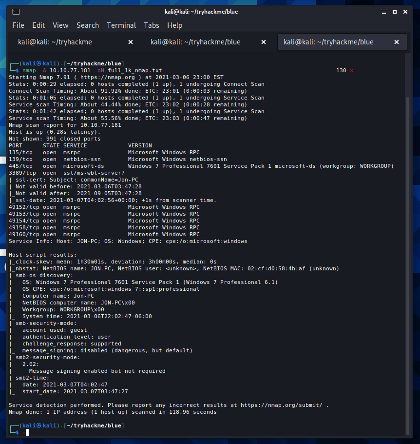

## Gain Access
To gain access to this machine we are going to utilise a tool called metasploit. Metasploit handles a lot of the heavy lifting involved with some hacking tasks and should speed up our entry into this machine.

We can search for the exploit we require inside of metasploit. Once we select the exploit it is just a matter of setting the RHOST and firing the exploit. It may be important to note, but depending on how your virtual machine is configured you may need to set you LHOST too.

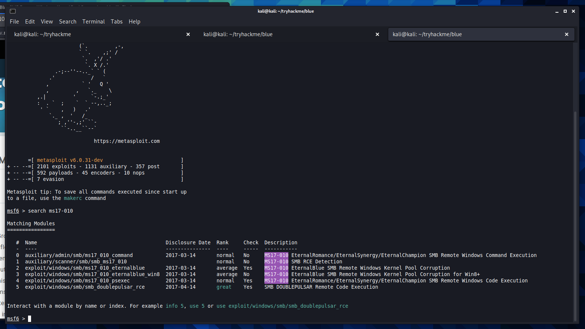

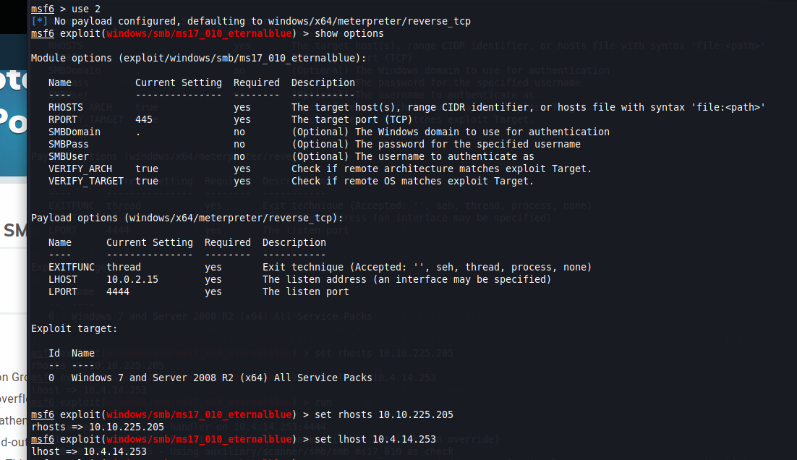

We are in! We have gained access to this machine and can now move on to the rooms next task. Using metasploit was able to save us time, while also saving us from having to manually download our export and set everything up. It is important to note that Eternal Blue is such a big thing and most exploits will not go this smoothly.

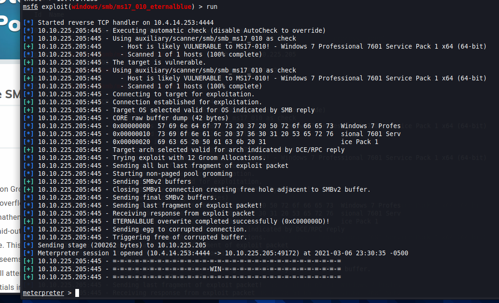

## Escalate 
Now that we have access to the machine it's time to escalate. We are going to do this by upgrading our shell to a meterpreter shell, giving us access to additional functionality.

We are tasked with googling the metasploit module used to do this, but I choose to take a stab at the built in search function. We find the module in question and set the session to the backgrounded shell we popped with the ms17-010 exploit we ran earlier. We are able to upgrade our shell and we can move onto the next section.

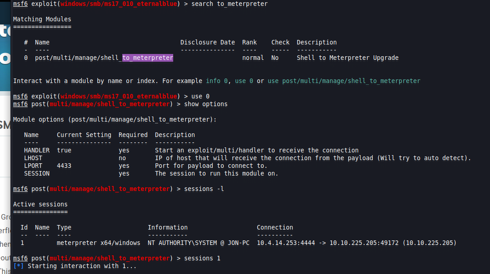

## Cracking 
This task requires us to find a list of hashed passwords on the system, and crack the non-default users password. We use the hashdump command to get the list of hashed passwords. We can see that our non-default user is Jon. We can take Jons hashed password and save it into a file before feeding it to a cracking tool called John the Ripper. Just like that we have our password for Jon, we get out points, and we can move on to the next section.

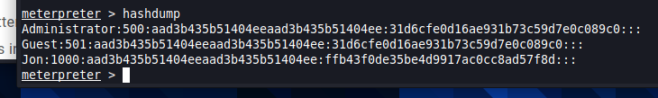

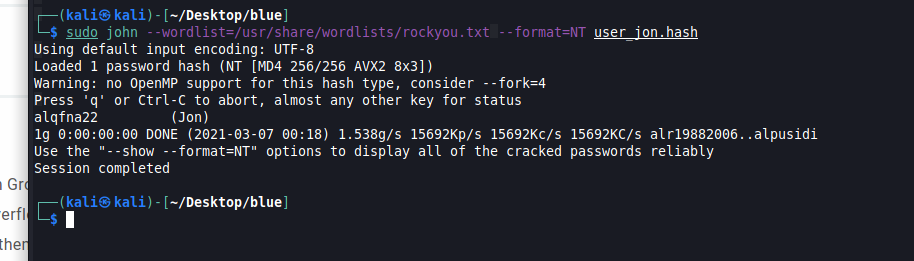

## Find Flags!
This section is all about moving around the system we now own. We are given 3 hints and told to find 3 non standard flags that have been hidden around the system.

The hints are:
- flag1?? This flag can be found at the system root. 
- flag2?? This flag can be found at the location where passwords are stored within Windows.
- flag3?? This flag can be found in an excellent location to loot. After all, Administrators usually have pretty interesting things saved. 

Flag 1 seems easy, I will just run a cd \ command. It's here and we can run the type command to output the flag.

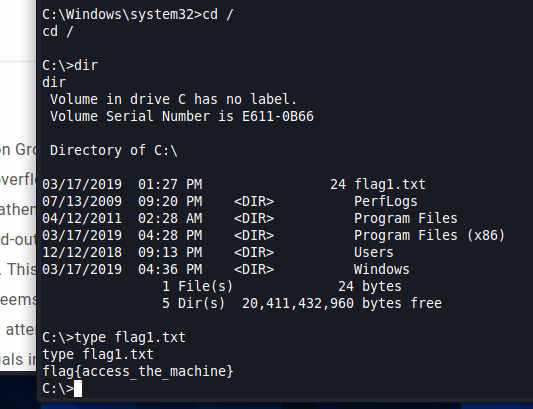

A quick google search tells me that Windows stores passwords in the config directory. I cd over and collect my flag.

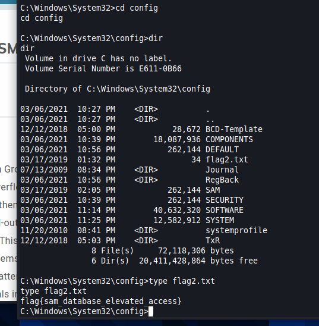

We know that we own this system, so I figure they must be referring to the person directories. I cd my way into the Documents directory and find our final flag.

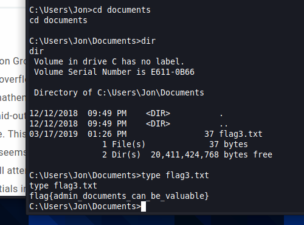

Just like that we are done! We have completed all the tasks presented by the room and can now close it off. The room was a fun look into the metasploit framework and allowed us to deploy one of the most notorious exploits against the machine.

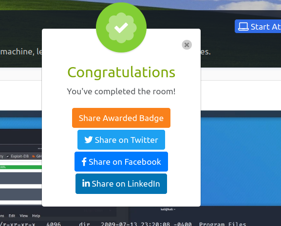