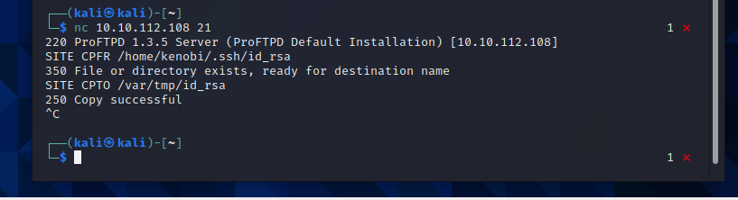
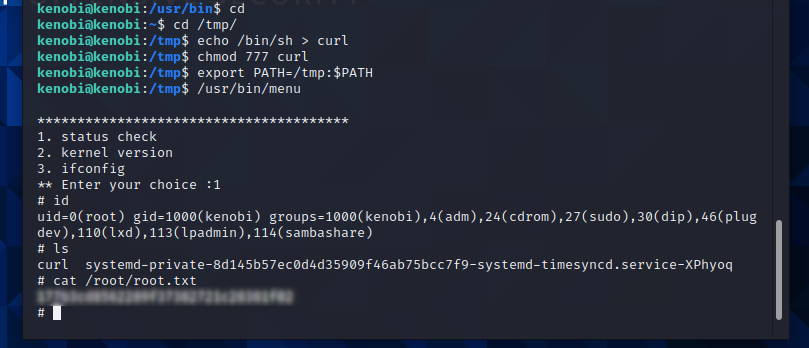

# Kenobi
Walkthrough on exploiting a Linux machine. Enumerate Samba for shares, manipulate a vulnerable version of proftpd and escalate your privileges with path variable manipulation. This room will cover accessing a Samba share, manipulating a vulnerable version of proftpd to gain initial access and escalate your privileges to root via an SUID binary.

## Deploy the vulnerable machine
As always we begin by deploying our machine. Once deployed we can  do a quick nmap scan to see what and how many ports are open.

## Enumerating Samba for Shares
Samba is the standard Windows interoperability suite of programs for Linux and Unix. It allows end users to access and use files, printers and other commonly shared resources on a companies intranet or internet. Its often referred to as a network file system. Samba is based on the common client/server protocol of Server Message Block (SMB). SMB is developed only for Windows, without Samba, other computer platforms would be isolated from Windows machines, even if they were part of the same network.

Using an nmap script we can enumerate the mahine for SMB shares. There are other tools to do this that might be a little easier, but the room suggest an nmap script so we will stick with that.

nmap -p 445 --script=smb-enum-shares.nse,smb-enum-users.nse MACHINE_IP

From here we can use smbclient to connect to the machines netwrok share. Anonymous login is allowed so we don't need a password and can just hit enter. Once in we can ls the files availiable to us to see that log.txt can be read. We can then cat the contents of log.txt to discover it actually contains lots of important information about ssh keys and FTP port numbers. Our initial nmap scan showed port 111 to be running the rcpbind service. This is access to an NFs that we can further enumerate to discover mounts. 

## Gain initial access with ProFtpd
We know that the machine is running version 1.3.5 of ProFtpd so we connect to the machine using netcat. Now we can use the searchsploit command to check for any known exploits related to this version of ProFTPD. We have one, the mod_copy module. The mod_copy module implements SITE CPFR and SITE CPTO commands, which can be used to copy files/directories from one place to another on the server. Any unauthenticated client can leverage these commands to copy files from any part of the filesystem to a chosen destination. We are going to copy the key of the user we found, Kenobi, using SITE CPFR and SITE CPTO commands. While here we can also mount the /var/tmp directory we found earlier to our machine. Now that we have a network mount on our machine we can go to /var/tmp and use the private key to login and collect our user flag.

## Priviledge Escalation with Path Variable Manipulation
We are going to use a similar tactic, SUID bits, to the one we used in the Vulnversity room to gain root on this machine. 

SUID bits can be dangerous, some binaries such as passwd need to be run with elevated privileges (as its resetting your password on the system), however other custom files could that have the SUID bit can lead to all sorts of issues. 

We run find / -perm -u=s -type f 2>/dev/null to find any SUID files. When looking through the results for something interesting we see /usr/bin/menu. We can run this binary and see it's a simple program that offers limited functionality. It does however run with root priviledges so we can probably ake advantage of it. 

With both the user flag and root flags submitted we have finished the room.

