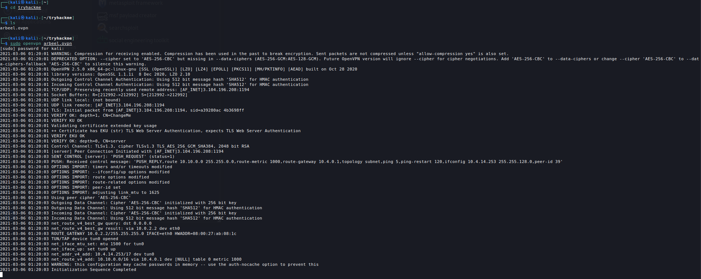
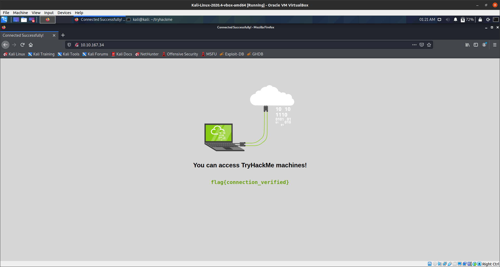
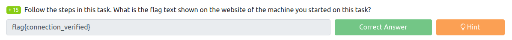
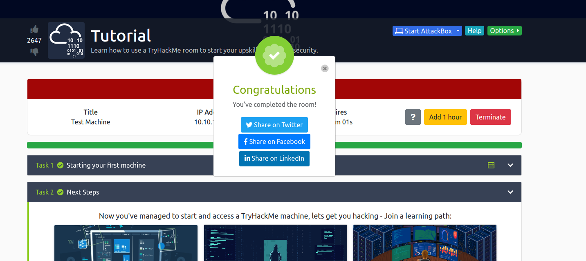

# Tutorial
Learn how to use a TryHackMe room to start your upskilling in cyber security.

## Task 1
This room is all about learning how to access the tryhackme boxes, and task 1 is to VPN into the box, open firefox, and collect a flag. We do this by deploying the machine and waiting for the machines IP address to be displayed. Once we have the IP address it's time to jump over to our kali box and VPN in. We are using openvpn which is installed as standard in all modern kali images. When setting up our tryhackme account we were prompted to downlaod the openvpn configuration file. when running openvpn against this file we can connect.

After connecting it's just a matter of opening our browser and collecting the flag which is displayed front and centre.

Now that we have the flag we can input it into the answer section of the tryhack me website.

## Task 2
Task two simply invites us to join on of their learning paths.

1. Complete Beginner is a great learning path for those who don't have a technical background. It covers basic networking, tooling and concepts that new techies could find valuable.

2. Cyber Defence is geared towards defending against attacks, intelligence gathering and responding to incidents.

3. Offensive Pentesting is about learning to utilise tooling that is standard in the industry to identify and attack system vulnerabilities. This is the course that I will be focussing on for the forseeable future.

Now that we have completed the room we can see a nice little congratulations popup.

