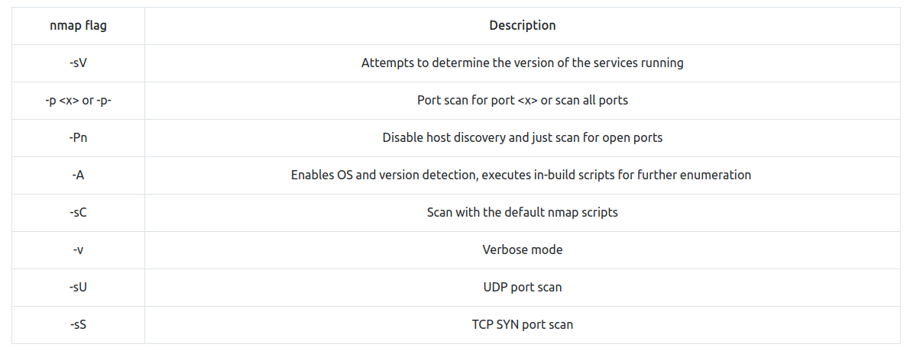
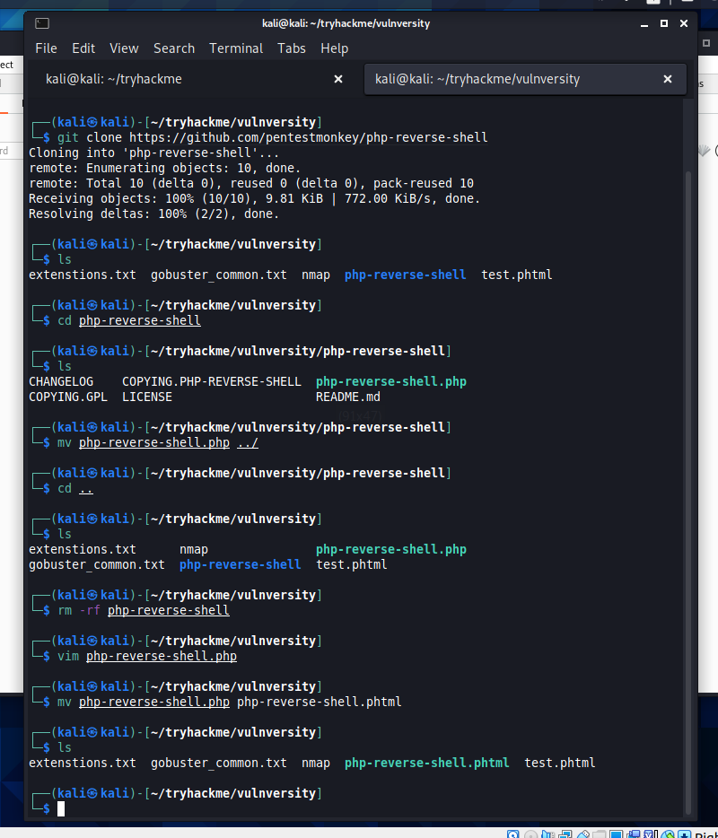

# Vulnversity
Learn about active recon, web app attacks and privilege escalation. Enumerate web directories, use Burp Suite, and explore SUID privilege escalation in this room.

## Deploy the machine
As always, our first step is to deploy the machine so that we can VPN into the room from our kali box. I left several times throughout this room to deal with real life tasks so you may notice the IP changes a few times throughout the course of this writeup.

## Reconnaissance 
The Reconnaissance section of this room is about exactly what it sounds like, recon! We are tasked with using the popular network scanning tool nmap to find information about the open ports on this machine. 

A quick overview of some of the most common nmap flags is provided.

I have a favourite scan that I tend to default to when using nmap, as seen below. Broken down I am running an aggressive scan (-A) that can detect OS, versions and executes built in scripts. I run the scan against all ports (-p-) at an aggressive speed (-T4). I also output the results of the scan to a txt file called nmap in my working directory called.

The scans can take some time so I run through the questions to see if anything can be answered without the results. We find the below questions and are able to answer them ourselves.

- How many ports will nmap scan if the flag -p-400 was used? 400
- Using the nmap flag -n what will it not resolve? DNS

I actually wasn't too sure on the second question so utilised the man command on nmap which provides a nice little manual from which I was able to find my answer. Soon our nmap scan is done and we are able to view the results and answer the other questions.

We can see that a total of 6 ports are open and the most likely operating system is Ubuntu. Additionally we know that the version of squid proxy running on the machine is 3.5.12, and the web server is running on port 3333. This last point is interesting as http servers are usually run on port 80, and https on port 443. Either way I wanted to view what was running so I fired up my browser and navigated to the address. 

## Locating directories using GoBuster
Now that we have some intel on our target, it's time to take it one step further and see what else we can find. We are going to use GoBuster to scan the website by looking for any hidden directories that may be useful to us. GoBuster is a simple to use tool that takes a wordlist, several commands and the target url as input. I also run the -o flag to save the output to a txt file. We are tasked with finding a directory that contains an upload form. When looking at the results, the directory that immediately gets my attention is internal. I navigate to that directory and find out file upload functionality.

## Compromise the webserver
Now we have found a form to upload files, we can leverage this to upload and execute our payload that will lead to our compromising the web server. Our first task is to find out what common file extensions are blocked from upload. If we think back to the results of our nmap scan, our web server is running on Apache. I decide to try uploading a .php file and it's blocked. We have our answer!

To manually go through looking for file extensions that aren't blocked would be time consuming and unproductive. I create a small .txt file containing some php file extension variations and fire up Burp Suite with intercept turned on.

I first upload a test file that I know will be blocked.

I have captured the POST request in Burp Suite where I can see the structure of the request. I send the request to Intruder to begin setting up our attack. In Intruder I highlight the filename extension and mark it as a variable. We then create our payload by uploading the php extension file that we created earlier. The attack will run through all of the extensions on our list, brute forcing the upload form until we find a permitted extension. 

We have a hit! The form allows for phtml files to be uploaded. This is great news for us because it means we can upload a php reverse shell to attempt to gain access to the system. 

I now move through several steps that include cloning the reverse shell I want to use from the pentestmonkey GitHub account. Following this I run some commands to move the file into place, changing a few lines of code to input my own ip / port details, and then change it to a phtml extension type that we know the upload form will accept.

We set up a listener on port 9999 using netcat before uploading the file. After upload we can navigate the below address to execute the payload.

http://<ip>:3333/internal/uploads/php-reverse-shell.phtml  

We are in! From here we are tasked with finding the user name and flag on the machine. This requires a simple poke around and we easily uncover the information we are looking for.

## Priviledge Escalation
Now you have compromised this machine, we are going to escalate our privileges and become the superuser (root). 

We are tasked with running a search for all SUID files on the system, looking for anything that stands out. I do some research and end up finding what I'm looking for. Immediately I notice the /bin/systemctl file. The systemctl command is a utility that is responsible for controlling the systemmd system and service manager. I double check my personal system by running the same search and confirm that systemtctl should not be a SUID file.

From here I have done some research and found several options that I can use. The first is GTFOBins which provides a curated list of Unix binaries that can used to bypass local security restrictions in misconfigured systems. The second is a script called SUID3NUM which actually goes one step further and also analyses the machine for any vulnerable SUID bins. While we already know what our vulnerable SUID bin is, I wanted to use this option as it seemed a little more fun.

I needed to get the suid3num.py file on to the target machine so I set up a quick HTTP server on my machine using python. From here I can use wget to retrieve the file. Success, we have run the file!

From here we can move through the information provided to see that systemsctl is indeed a vulnerable bin on this machine. The script also provides us with the commands needed to exploit the machine.

TF=$(mktemp).service

echo '[Service]

Type=oneshot

ExecStart=/bin/sh -c "id > /tmp/output"

[Install]

WantedBy=multi-user.target' > $TF

./systemctl link $TF

./systemctl enable --now $TF

We need to alter these commands to fit our purpose, but I'm going to leave that to you to figure out. Think about what we are searching for (hint - root.txt) and what the commands are actually doing. From there we can see the output file when we run the list command on the tmp directory. We can cat the output file and..... we have the root flag! This is the final question we needed to answer on this room and we are done.

